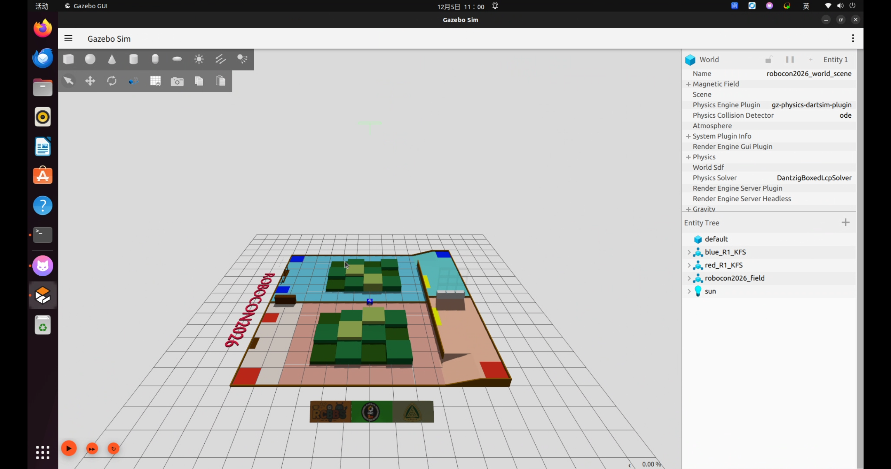

# use gazebo harmonic and ros2 humble


## environment setting
```bash
export GZ_SIM_RESOURCE_PATH=$GZ_SIM_RESOURCE_PATH:$(ros2 pkg prefix weapon_dock)/share
```

```bash
rosdepc update # "sudo rosdep update --include-eol-distros" for Foxy and earlier
rosdepc install -i --from-path src --rosdistro $ROS_DISTRO --skip-keys=librealsense2 -y
```


嘻嘻